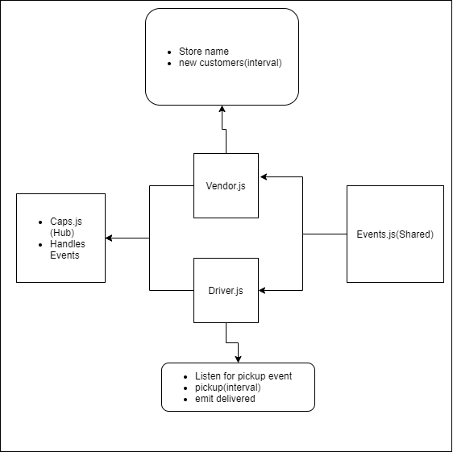

# caps
Caps lab simulating event driven apps using vendor and driver

## Project: Caps

### Author: Brendon

### Links and Resources

- [submission PR]()
- [ci/cd](https://github.com/brendon-401-advanced-javascript/caps/actions) (GitHub Actions)
- [back-end server url](http://xyz.com) (when applicable)
- [front-end application](http://xyz.com) (when applicable)

### User Stories

* As a vendor, I want to alert the system when I have a package to be picked up
* As a driver, I want to be notified when there is a package to be delivered
* As a driver, I want to alert the system when I have picked up a package and it is in transit
* As a driver, I want to alert the system when a package has been delivered
* As a vendor, I want to be notified when my package has been delivered

### Setup

#### `.env` requirements (where applicable)

npm i and add a .env file to your repo, then set the port to 3000.

#### How to initialize/run your application (where applicable)

--TO RUN THE APPLICATION--
- In the Terminal(s) run 
    - nodemon

#### How to use your library (where applicable)

#### Tests

- How do you run tests?
    - 
- Any tests of note?
- Describe any tests that you did not complete, skipped, etc
    - 

#### UML

Link to an image of the UML for your application and response to events

[Return to Directory](##Directory)

